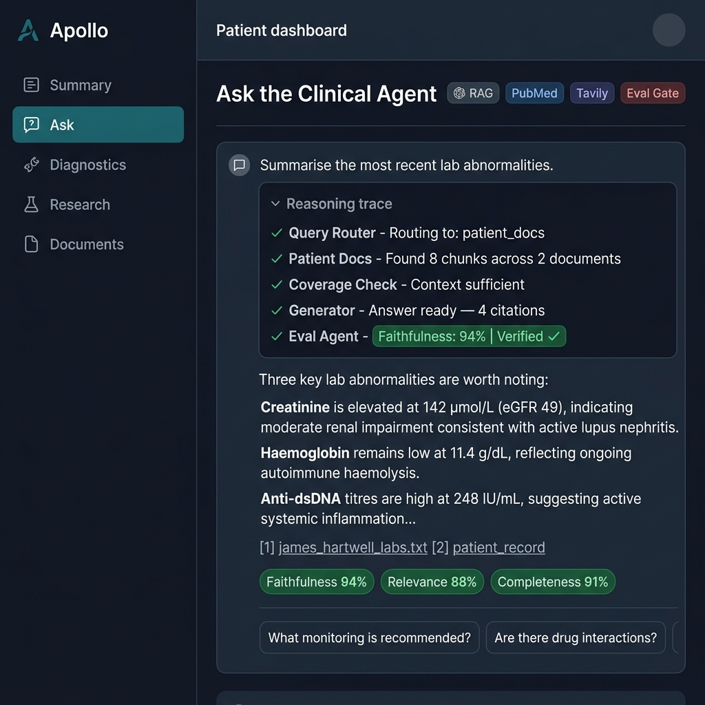
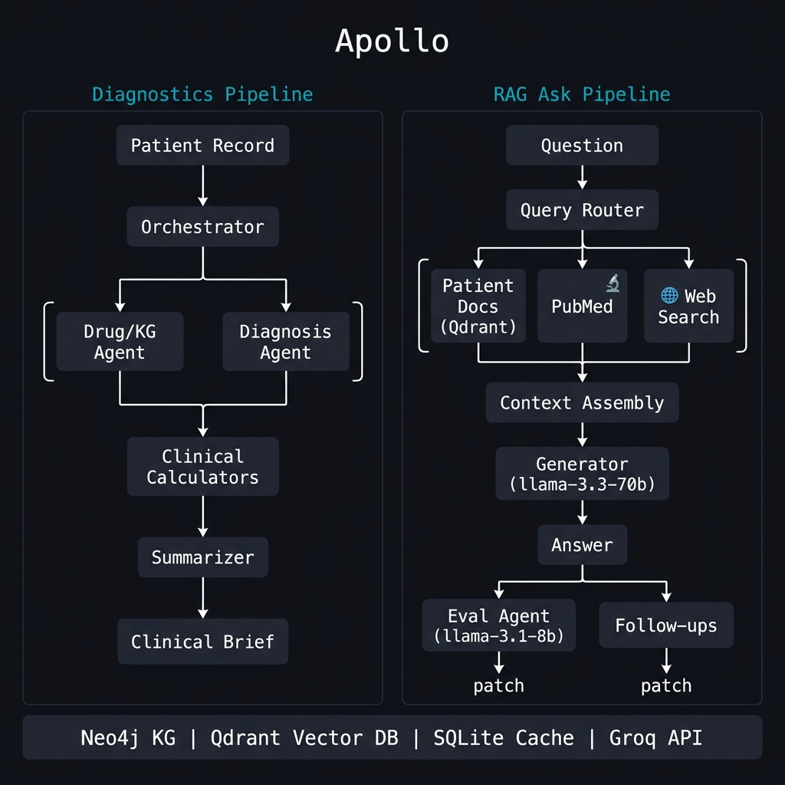

# Apollo — Clinical Intelligence Agent

A multi-agent system that reasons over patient records. Load a patient, ask clinical questions, get grounded answers with citations and faithfulness scores.



---

## What it does

Two independent pipelines run off the same patient record:

**Diagnostics pipeline** — runs on page load, streams each step live:
- Drug/KG agent checks medication combinations against a Neo4j knowledge graph
- Diagnosis agent proposes a ranked differential with ICD-10 codes and supporting evidence
- Clinical calculators run ASCVD 10-year risk and Wells DVT score from structured lab data
- Summarizer generates a structured clinical brief + plain-English patient summary

**RAG ask pipeline** — triggered by a question, also streamed:
- Query router classifies the question and picks retrieval sources
- Patient docs (Qdrant), PubMed abstracts, and web search run in parallel
- Structured patient record is always injected as the top-ranked context chunk
- Generator answers using `llama-3.3-70b-versatile`, citing specific sources
- Answer streams immediately — eval scoring and follow-up suggestions patch in async
- SQLite answer cache makes repeated questions instant



---

## Stack

| | |
|---|---|
| Orchestration | LangGraph stateful graph |
| LLM | Groq `llama-3.3-70b-versatile` (generation), `llama-3.1-8b-instant` (eval) |
| Fallback LLM | Google Gemini `gemini-2.0-flash` (summarizer only) |
| Knowledge Graph | Neo4j — 25 clinical conditions |
| Vector Store | Qdrant |
| Cache | SQLite (answers, summaries, PubMed, chunks) |
| Document Parsing | Docling, PyMuPDF |
| Web Search | Tavily (primary), DuckDuckGo (fallback) |
| API | FastAPI + WebSocket streaming |
| Frontend | CSS/JS |
| Infra | Docker Compose |

---


## Running it

```bash
git clone https://github.com/anushacodes/apollo-healthcare-agent.git
cd apollo-healthcare-agent
cp .env.example .env   # add GROQ_API_KEY
docker-compose up --build
```

Open `http://localhost:8000/app.html`

Minimum: `GROQ_API_KEY`. Optional: `GEMINI_API_KEY` (better summaries), `TAVILY_API_KEY` (web search), `NEO4J_PASSWORD` (knowledge graph).

---

## Project structure

```
app/
├── agent/
│   ├── rag_agent.py           # full RAG pipeline (LangGraph nodes + streaming)
│   ├── graph.py               # diagnostics pipeline (orchestrator, drug, diagnosis, calc, summary)
│   ├── eval_agent.py          # faithfulness + hallucination scoring
│   ├── diagnosis_agent.py     # differential diagnosis
│   ├── drug_interaction_agent.py
│   ├── summarizer.py
│   ├── research_agent.py      # PubMed fetch + background prefetch
│   ├── tools.py               # ASCVD, Wells DVT calculator
│   ├── sqlite_cache.py        # all caching logic
│   ├── kg_loader.py           # Neo4j + local JSON fallback
│   └── seed_patient.py        # demo patient definitions
├── ingestion/                 # PDF, image, audio parsing + Qdrant embedding
├── routers/                   # FastAPI endpoints (WebSocket, REST)
├── frontend/                  # HTML/CSS/JS UI
└── main.py

data/seed/                     # James Hartwell demo patient files
kg/                            # 25 condition JSON files
tests/                         # pipeline smoke tests
docker-compose.yml
```

---

## Demo patient

James Hartwell — 58M with SLE complicated by Class III lupus nephritis, antiphospholipid syndrome, and autoimmune haemolytic anaemia. Uploaded documents include clinical notes, lab reports, and a handwritten referral. Used as the primary test case throughout development.
