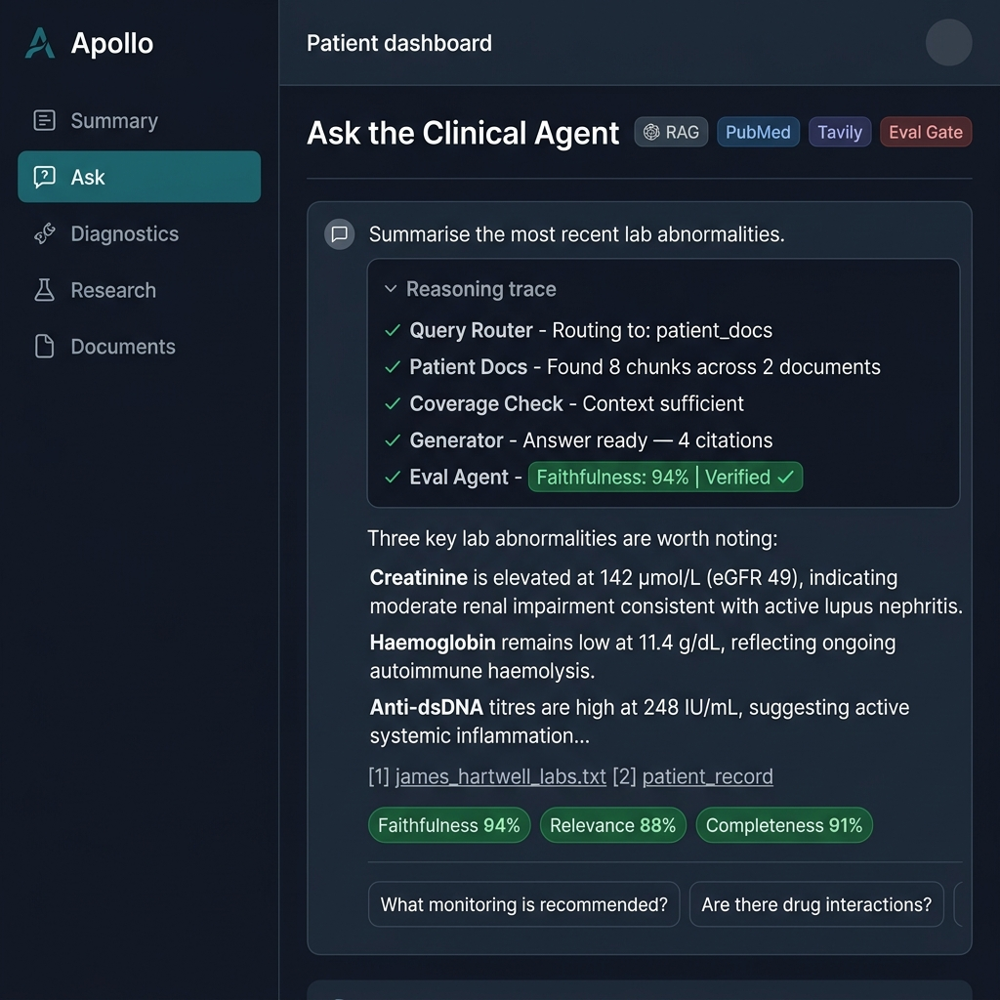
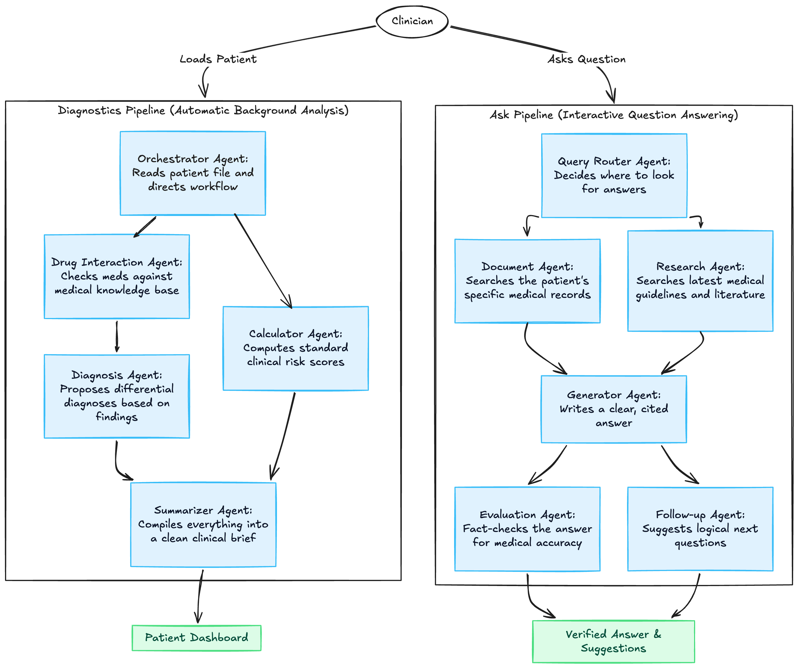

# Apollo

[](https://github.com/anushacodes/apollo-healthcare-agent/actions/workflows/lint.yml)


A multi-agent system that reasons over patient records — load a patient, ask
clinical questions, get grounded answers with citations and faithfulness
scores.

Healthcare is the domain; the point of the project is what's underneath it:
real LangGraph orchestration, hybrid retrieval, LLM-judge evaluation, and a
CI-gated engineering workflow. It is a portfolio project, not a clinical
product — see [Project status](#project-status).



---

## What this is

Two independent pipelines run off the same patient record, each streamed
live over WebSocket:

**Diagnostics pipeline** — a real LangGraph fan-out/fan-in graph:
```
                     ┌──────────────┐
                     │ Orchestrator │
                     └──────┬───────┘
              ┌─────────────┴─────────────┐
              ▼                           ▼
      ┌───────────────┐           ┌───────────────┐
      │ Drug/KG Agent │           │  Tool Node     │
      │ (interactions)│           │ (calculators)  │
      └───────┬───────┘           └───────┬───────┘
              └─────────────┬─────────────┘
                             ▼
                    ┌─────────────────┐
                    │ Diagnosis Agent │
                    └────────┬────────┘
                             ▼
                    ┌─────────────────┐
                    │   Summarizer    │
                    └─────────────────┘
```
- Drug/KG agent checks medications against a local clinical knowledge base, then an LLM reasons about interaction risk
- Diagnosis agent proposes a ranked differential with ICD-10 codes and supporting evidence
- Calculators run ASCVD 10-year risk, Wells DVT, and CHA₂DS₂-VASc from structured lab data
- Summarizer produces a structured clinical brief + plain-English patient summary

**RAG ask pipeline** — retrieval + generation, triggered by a question:
```
Query Router → {Patient Docs, Curated Corpus, Web Search (fallback)}
             → Context Assembler → Sufficiency Judge
             → Generator → Eval (faithfulness / hallucination) → Answer
```
- Router classifies the question and picks retrieval sources
- Patient docs (Qdrant + SQLite FTS5, fused with RRF) and a curated clinical guideline corpus are searched; live web search fills in when both come back sparse
- Generator answers with `llama-3.3-70b-versatile`, citing specific sources
- Every answer is scored for faithfulness/hallucination against its retrieved chunks before it's returned
- SQLite answer cache makes repeated questions instant



---

## Engineering highlights

- **Real graph orchestration** — the diagnostics pipeline has genuine
  parallel fan-out/fan-in branches in LangGraph, not a linear chain dressed
  up as a graph.
- **Hybrid retrieval** — dense vector search (Qdrant) fused with sparse BM25
  (SQLite FTS5) via reciprocal rank fusion, one pipeline serving both patient
  documents and the curated corpus.
- **Retrieval without a live external dependency** — the guideline corpus is
  chunked and embedded once at startup (`app/ingestion/corpus.py`) and reused
  from then on, instead of hitting a live API per request.
- **Eval as a pipeline stage, not an afterthought** — every RAG answer is
  scored for faithfulness and hallucination against its retrieved chunks
  before it's considered final.
- **CI on every push/PR** — ruff lint gate (badge above). A mocked test
  suite and CD are tracked as upcoming work.

---

## Quick start

**With Docker:**
```bash
git clone https://github.com/anushacodes/apollo-healthcare-agent.git
cd apollo-healthcare-agent
cp .env.example .env   # add GROQ_API_KEY
docker-compose up --build
```

**Without Docker** (uses [uv](https://docs.astral.sh/uv/)):
```bash
git clone https://github.com/anushacodes/apollo-healthcare-agent.git
cd apollo-healthcare-agent
cp .env.example .env   # add GROQ_API_KEY
uv sync
uv run uvicorn app.main:app --reload --port 8000
```

Qdrant is optional at runtime — the app logs a warning and falls back to
sparse-only retrieval if it's unreachable, so a bare Python + Groq key is
enough to boot and use the diagnostics pipeline.

Open `http://localhost:8000/app.html`

Minimum: `GROQ_API_KEY`. Optional: `GEMINI_API_KEY` (better summaries),
`TAVILY_API_KEY` (web search fallback).

---

## Try it

```bash
# List the pre-loaded demo cases
curl http://localhost:8000/api/agent/cases

# Run the diagnostics pipeline for a demo case (non-streaming variant)
curl -X POST http://localhost:8000/api/agent/run/demo-case-a \
  -H "Content-Type: application/json" \
  -d '{"case_key": "case_a"}'

# Ingest a document for RAG
curl -X POST http://localhost:8000/api/rag/ingest/demo-case-a \
  -F "file=@data/seed/case_a_labs.txt"
```

The diagnostics and RAG-ask pipelines are also available as WebSocket
endpoints (`/api/agent/run/{patient_id}`, `/api/rag/stream/{patient_id}`) —
that's what the frontend actually uses, since both pipelines stream
intermediate reasoning steps live rather than returning a single response.

---

## API endpoints

| Endpoint | Method | Description |
|---|---|---|
| `/api/agent/cases` | GET | List pre-loaded demo cases |
| `/api/agent/cases/{case_key}` | GET | Fetch one demo case's data |
| `/api/agent/run/{patient_id}` | WS / POST | Run the diagnostics pipeline (streaming / single-shot) |
| `/api/rag/stream/{patient_id}` | WS | Run the RAG ask pipeline, streaming reasoning + answer |
| `/api/rag/ingest/{patient_id}` | POST | Upload and embed a patient document |
| `/api/rag/sources/{patient_id}` | GET | List indexed source documents for a patient |
| `/api/kg/status` | GET | Local knowledge base status (condition count) |
| `/api/kg/conditions` | GET | List all known conditions |
| `/api/kg/conditions/{name}` | GET | Fetch one condition's knowledge block |
| `/api/patients/{patient_id}/summarize` | POST | Generate a structured clinical summary |

---

## Project structure

```
app/
├── agent/
│   ├── rag/                   # RAG pipeline package
│   │   ├── prompts.py         # prompt strings
│   │   ├── state.py           # RAGState TypedDict
│   │   ├── nodes.py           # LangGraph node functions
│   │   └── graph.py           # graph builder + streaming runner
│   ├── diagnostics/           # diagnostics pipeline package
│   │   ├── prompts.py         # orchestrator prompt
│   │   ├── state.py           # AgentState TypedDict
│   │   ├── nodes.py           # LangGraph node functions (real fan-out/fan-in)
│   │   └── graph.py           # graph builder + streaming runner
│   ├── eval_agent.py          # faithfulness + hallucination scoring
│   ├── diagnosis_agent.py     # differential diagnosis
│   ├── drug_interaction_agent.py
│   ├── summarizer.py
│   ├── tools.py               # ASCVD, Wells DVT, CHA₂DS₂-VASc calculators
│   ├── sqlite_cache.py        # all caching logic (thread-local connections, WAL mode)
│   ├── kg_loader.py           # local JSON knowledge base lookup
│   └── seed_patient.py        # demo patient definitions
├── ingestion/
│   ├── corpus.py              # one-time curated-corpus embedding (idempotent)
│   ├── chunker.py             # header-aware chunking with overlap
│   ├── embedder.py            # Qdrant + SQLite FTS5 hybrid embed/search
│   └── extractors/            # PDF, image, audio/transcript parsing (Docling)
├── routers/                   # FastAPI endpoints (WebSocket, REST)
├── llm_client.py              # shared Groq client singleton
├── config.py                  # pydantic-settings, single source of runtime config
├── frontend/                  # HTML/CSS/JS UI
└── main.py

assets/
├── ask_ui.png                 # home UI screenshot
└── flowchart.png              # system architecture diagram
data/seed/                     # demo patient files (Case A/B/C)
data/corpus/                   # curated guideline corpus (retrieval-quality demo)
knowledge_graph/                # 25 condition JSON files
tests/                          # pipeline smoke tests
docker-compose.yml
```

---

## Tech stack

| Layer | Technology | Purpose |
|---|---|---|
| Orchestration | LangGraph | Real fan-out/fan-in graph + streaming RAG graph |
| LLM | Groq (`llama-3.3-70b-versatile`, `llama-3.1-8b-instant`) | Generation, structured extraction, eval |
| Retrieval | Qdrant (dense) + SQLite FTS5 (sparse), RRF fusion | Hybrid patient-document and corpus search |
| Knowledge base | Local JSON, 25 conditions | Condition/symptom lookup |
| Document parsing | Docling, PyMuPDF | PDF/image/audio ingestion |
| Web search | Tavily (clinical-domain restricted), DuckDuckGo fallback | Sparse-retrieval fallback |
| API | FastAPI + WebSocket streaming | REST + live pipeline streaming |
| Dependency management | uv | Lockfile-based, reproducible installs |
| CI | GitHub Actions (ruff) | Lint gate on every push/PR |
| Frontend | Vanilla CSS/JS | No framework |
| Infra | Docker Compose | Local multi-service dev environment |

---

## Key design decisions

| Decision | Rationale |
|---|---|
| LangGraph for diagnostics, not for RAG's linear steps | The diagnostics pipeline has real parallel branches worth expressing as a graph. The RAG pipeline is currently a linear chain — kept honest as a plain sequence rather than forcing graph machinery onto steps that don't branch (a rework to real conditional routing is tracked as upcoming work). |
| Curated corpus over live PubMed fetch | A live per-request API call added latency, rate-limit fragility, and an external dependency with no offline story, for a retrieval-quality benefit that a small, well-chunked static corpus already delivers. |
| Local JSON knowledge base over Neo4j | The graph database added real operational cost (a service to run, seed, and keep in sync) for lookups that were never more than key-based reads — no genuine graph traversal was happening. |
| Hybrid dense + sparse retrieval | Dense embeddings catch semantic matches; BM25 catches exact terminology (drug names, lab codes) that embeddings can blur. Reciprocal rank fusion combines both without needing a re-ranking model. |
| Eval gate on every RAG answer | Faithfulness/hallucination scoring runs before an answer is treated as final, not as a detached offline metric computed after the fact. |
| Deliberately not grounding drug interactions against RxNorm/OpenFDA | Evaluated and skipped: the free structured interaction-lookup APIs most projects reach for here have been discontinued, and label-text scraping added complexity out of proportion to the payoff for a demo feature. |

---

## Running tests

```bash
uv run python -m pytest tests/ -v   # pipeline smoke tests
uv run ruff check .                 # lint
```

A proper mocked test suite (`TestClient` + mocked LLM/vector-store calls, no
live-network dependency) is tracked as upcoming work — the current tests are
smoke-level only.

---

## Project status

Apollo is mid-refactor: moving from a clinical demo toward a fuller agentic
AI / ML engineering showcase — real graph orchestration, evaluation,
observability (Langfuse, not yet wired up), data engineering, and safety
guardrails are the active focus areas, deliberately over deeper clinical
logic. Expect some rough edges and in-progress pieces.
